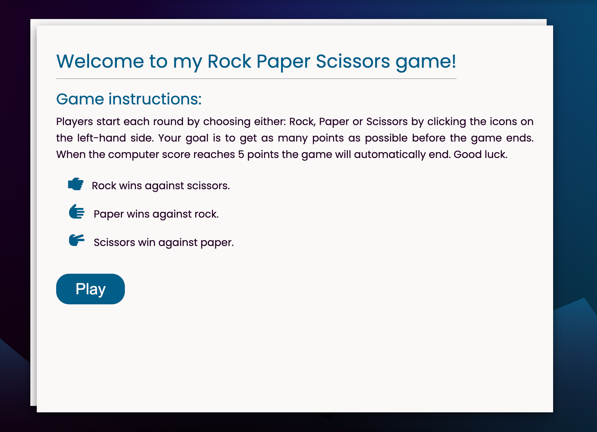
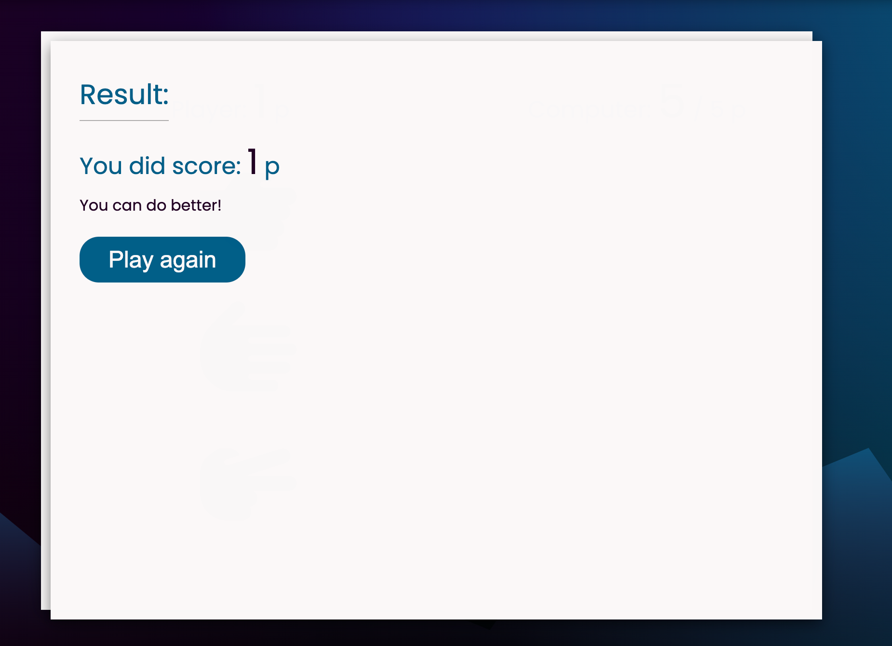
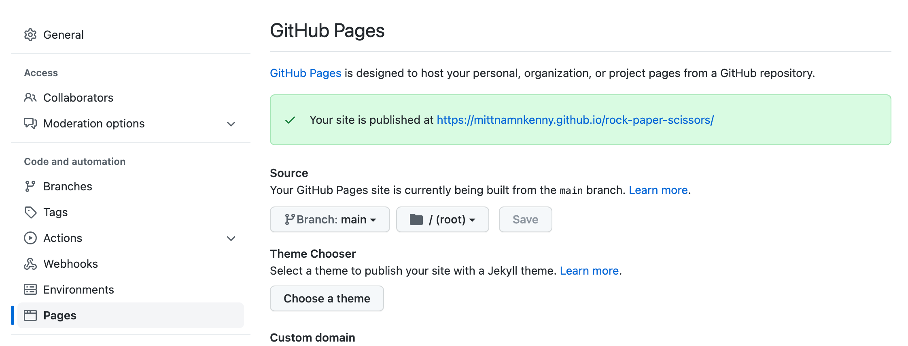

# My Rock Paper Scissors game

For the second milestone assignment with Code Institute, I have created a classic Rock Paper Scissors game. This game is single player only, where the user will try to get as many points as possible before the computer score reaches 5 points.
The user will choose one of the three choices and try to beat the computer; the chance is random.

The rules remain the same as the original game: Rock beats scissors. Scissors beat paper, and paper beats rock. The rules are easy; the game is both simple and fun.

This site is targeted toward people who have an interest in both gaming and JavaScript.

[View the live project here.](https://mittnamnkenny.github.io/rock-paper-scissors/)

##  User Experience (UX)

- ### User stories

    -   #### First Time Visitor Goals

        1. As a First Time Visitor, I want to easily understand the main purpose of the site.
        2. As a First Time Visitor,  I want to be able to easily navigate throughout the site.
        3. As a First Time Visitor,  I want the site to be visually appealing regardless of screen size.
        4. As a First Time Visitor, I want to easily find instructions on how to play the game.
        5. As a First Time Visitor, I want the game to function as expected.
        6. As a First Time Visitor, I want to be able to restart the game at any time.
        7. As a First Time Visitor, I want to be able to see both my score and the computer.

    -   #### Returning Visitor Goals

        1. As a Returning Visitor, I want to continue playing the game because it’s fun.
        2. As a Returning Visitor, I want to revisit the site because it’s visually appealing.
        3. As a Returning Visitor, I want to visit mittnamnkenny’s GitHub.

    -   #### Frequent User Goals
        1. As a Frequent User, I want to improve on my previous attempts and beat my high score.

## Features

### Existing Features

#### Header

  - The Header is featured at the top of the page.
  - Shows the logo ”mittnamnkenny” in the left corner.
  - The user will clearly see that this game was created by mittnamnkenny.
  - The right part contains the navigation.

  

#### Navigation

  - The navigation is positioned on the right-hand side of the header area.
  - When on smaller devices the navigation goes underneath the header logo.
  - Two buttons included: Instructions and restart game, with matching Font Awesome icons.
  - The user will be able to read the instructions of the game at any time.
  - The user will be able to restart the game at any time.
  - The navigation buttons all change text colour when hovered over.

#### Welcome Page

  - This page is first presented as the user visits the site.
  - Includes a Welcome message and clearly informs the user that this is a Rock Paper Scissors game.
  - The user will be able to read the game instructions before pressing the play button and entering the game area.
  - This section will inform the user on how to play the game.
  - The play button will bring the user to the game area. The button will change background colour when hovered over.

#### Game Page

  - Player and computer score are featured at the top of this page.
  - Clearly informs the user that the game will end when the computer score reaches 5 points.
  - The user is presented with a choice of options to choose from to play: Rock, Paper, or Scissors. These options are interactive icons that change background colour when hovered over.
  - When the user clicks on one of these icons, the computer will choose a random option and display it to the user together with a popup message with text: Tie, Win or Loss.
  - The icons will change colour depending on the outcome. (Win = Green, Red = Loss)

#### Result Page

  - When the computer score reaches 5 points, the result page will be presented to the user.
  - The user will see the outcome of the game. Player score are presented.
  - Depending on how many points are received, a short message to motivate the user to continue playing the game is displayed.
  - A play again button will take the user back to the game page and reset the player and computer score. The button will change background colour when hovered over.

#### Footer

  - The Footer is featured below the main page area.
  - A centered link with text ”Visit my GitHub page” with matching Font Awesome icon will take the user to mittnamnkenny’s GitHub repo, opens in a new tab.
  - The link will change text colour when hovered over.

#### Meta Data

  - My Rock Paper Scissors Game

### Features Left to Implement

- Make the website available in two languages;  English and Swedish.

## Design

- I have used a mixture of dark purple #210024 and blue sapphire #0b5e8a as the main colour theme for this site.
- All page sections have a background colour of snow #FBF8F8 to make the text stand out and easy to read.

- Scalable Vector Graphic are used for the background image with a fallback background colour if the image should fail to load.
- One SVG-wave was positioned at the bottom to improve the overall design.
- Google Fonts were used to import the font family Poppins that was chosen and used throughout the whole site with Sans Serif as the fallback font. Poppins both looks good and is easy to read.

## Technologies Used

- HTML5
- CSS3
- JavaScript
- [Google Fonts:](https://fonts.google.com/) To import font family ’Poppins’ into the style.css file which is used throughout the website. Added fallback font sans-serif.
- [Font Awesome:](https://fontawesome.com/) Was used in header and contact section to add icons for aesthetic and UX purposes.
- [SVG Backgrounds:](https://svgbackgrounds.com/) Scalable Vector Graphic used for the background image. Should the background image fail there is a fallback background colour set so the page still functions.
- [SVG Wave Generator:](https://softr.io/tools/svg-wave-generator/) Used to generate a gradient SVG wave.
- [Gauger:](https://gauger.io/fonticon/) Create beautiful favicon with ease.
- [Am I Responsive:](http://ami.responsivedesign.is) Checking the responsive.
- [Git](https://git-scm.com/) Git was used for version control by utilizing the Gitpod terminal to commit to Git and Push to GitHub.
- [GitHub:](https://github.com/) GitHub is used to store the projects code after being pushed from Git.

## Testing

### Browser testing
- I have tested that this page works using macOS (Macbook Air).
- I have tested that this page works in the following browsers using macOS: Chrome, Safari and Firefox.
- I have tested this page works on iOS devices using Safari browser (iPhone X and iPad Air).

### Responsivness
- Chrome developer tool have been used to check the responsivness.
- I have tested that this page works on different screen sizes from iPhone 5 (320px wide) and very large screens like 5K iMac Pro (5120 x 2880 px).

### Validator Testing 

The W3C Markup Validator and W3C CSS Validator Services were used to validate all pages of the project to ensure there were no syntax errors in there.

- W3C Markup Validator

- W3C CSS Validator

JSHint was used to validate the JavaScript with no errors highlighted.
- JSHint

I have confirmed that the colours and fonts chosen are easy to read and accessible by running it through lighthouse in Chrome developer tools.

- Lighthouse

### Functionality

| ID | Test Label                              | Test Action                                                     | Expected Outcome                                                                                                                                          | Test Outcome                                                                        |
|----|---------------------------------------- |-----------------------------------------------------------------|-----------------------------------------------------------------------------------------------------------------------------------------------------------|-------------------------------------------------------------------------------------|
|  1 | Welcome to my Rock Paper Scissors game! | When a user enters the website                                  | The user is presented with the welcome page and the instructions on how to play the game                                                                  | PASS                                                                                |                                                                                                                                                                                                                                                                                                            |
|  2 | Welcome page / Game Setup               | User clicks on the play button                                  | The welcome page disappears and the user is presented with the game page                                                                                  | PASS                                                                                |                                                                                                                                                                                                                                                                                                            |
|  3 | Game area / Icons                       | The user clicks one of the three icons: Rock, Paper or Scissors | The computer will display a random icon, either Rock, Paper or Scissors, and depending on the outcome a popup will appear with the text: Tie, Win or Loss | PASS                                                                                |                                                                                                                                                                                                                                                                                                            |
|  4 | Game area / Icons colours               | The user clicks one of the three icons: Rock, Paper or Scissors | The icon colour for both player and computer will change to green when win and red when loss                                                              | PASS                                                                                |                                                                                                                                                                                                                                                                                                            |
|  5 | Game area / Incrementing score          | The user clicks one of the three icons: Rock, Paper or Scissors | Player or computer score will increment by 1 p depending on the outcome                                                                                   | PASS                                                                                |                                                                                                                                                                                                                                                                                                            |
|  6 | Game area / Spamming the icons          | User clicks on the player icons in rapid succession             | The score should increment correctly and the animations should still function                                                                             | *PASS / Depending on how fast the user clicks the animations will be hard to follow |                                                                                                                                                                                                                                                                                                            |
|  7 | Game area / Result                      | When computer score reaches 5 p                                 | The user will be presented with the result page                                                                                                           | PASS                                                                                |                                                                                                                                                                                                                                                                                                            |
|  8 | Result page / Score                     | Player score                                                    | The user is presented with the correct points received                                                                                                    | PASS                                                                                |                                                                                                                                                                                                                                                                                                            |
|  9 | Result page / Text message              | Text message                                                    | The user is presented with the correct text message depending on the received player score                                                                | PASS                                                                                |                                                                                                                                                                                                                                                                                                            |
| 10 | Result page / Play again                | User clicks on the play again button                            | The user will be presented with the game page and both player and computer score are reset                                                                | PASS                                                                                |                                                                                                                                                                                                                                                                                                            |
| 11 | Navigation / Instructions               | User clicks on the Instructions                                 | The user can read the instructions at any time without compromising the game                                                                              | PASS                                                                                |                                                                                                                                                                                                                                                                                                            |
| 12 | Navigation / Restart game               | User clicks on Restart Game                                     | The user can restart the game at any time                                                                                                                 | PASS                                                                                |                                                                                                                                                                                                                                                                                                            |
| 13 | Footer / Social networks                | User clicks on Visit my GitHub page                             | My repo opens in a new tab and the address is correct                                                                                                     | PASS                                                                                |                                                                                                                                                                                                                                                                                                            |

### Further Testing

- I have tested that the hover effect on all buttons and links works as expected.
- I have tested that all animations work correctly.
- I have tested that all Font Awesome icons are displayed correctly.

### Solved bugs

- When using Safari browser user-select: none; was added to the body in the style.css file, to prevent text/element selection, that could happen when playing the game and entering the result page due to the animations and numbers of clicks.
This is not considered a bug, but it will affect the overall design.

## Deployment

- The site was deployed to GitHub pages. The steps to deploy are as follows:
  - Log in to GitHub and locate the GitHub Repository.
  - In the GitHub repository, navigate to the "Settings" tab.
  - In Settings, choose "Pages" from the left hand menu.
  - Under "Source", select branch "Main" and select folder "(Root)".
  - Click Save and the page will be automatically refreshed with a detailed ribbon display to indicate the successful deployment.

## Credits

- [Google Fonts:](https://fonts.google.com/) To import font family ’Poppins’.
- [Font Awesome:](https://fontawesome.com/) Was used to add icons.
- [SVG Backgrounds:](https://svgbackgrounds.com/) Scalable Vector Graphic used for main background.
- [SVG Wave Generator:](https://softr.io/tools/svg-wave-generator/) Used to generate a gradient SVG wave.
- [Gauger:](https://gauger.io/fonticon/) Create beautiful favicon with ease.
- [Am I Responsive:](http://ami.responsivedesign.is) Checking the responsive.

### Code

* [SVG Wave Generator:](https://softr.io/tools/svg-wave-generator/) code used to generate a gradient SVG wave:

    `<svg id="wave" style="transform:rotate(0deg); transition: 0.3s" viewBox="0 0 1440 270" version="1.1" xmlns="http://www.w3.org/2000/svg"><defs><linearGradient id="sw-gradient-0" x1="0" x2="0" y1="1" y2="0"><stop stop-color="rgba(33, 0, 36, 0)" offset="0%"></stop><stop stop-color="rgba(11, 94, 138, 1)" offset="100%"></stop></linearGradient></defs><path style="transform:translate(0, 0px); opacity:1" fill="url(#sw-gradient-0)" d="M0,108L130.9,0L261.8,81L392.7,189L523.6,27L654.5,162L785.5,216L916.4,27L1047.3,81L1178.2,27L1309.1,216L1440,54L1570.9,27L1701.8,0L1832.7,189L1963.6,243L2094.5,189L2225.5,108L2356.4,189L2487.3,135L2618.2,162L2749.1,216L2880,54L3010.9,54L3141.8,0L3141.8,270L3010.9,270L2880,270L2749.1,270L2618.2,270L2487.3,270L2356.4,270L2225.5,270L2094.5,270L1963.6,270L1832.7,270L1701.8,270L1570.9,270L1440,270L1309.1,270L1178.2,270L1047.3,270L916.4,270L785.5,270L654.5,270L523.6,270L392.7,270L261.8,270L130.9,270L0,270Z"></path></svg>`
  
* [SVG Backgrounds:](https://svgbackgrounds.com/) code for background "Spectrum gradient":

    background-image: url("data:image/svg+xml,%3Csvg xmlns='http://www.w3.org/2000/svg' width='100%25' height='100%25' viewBox='0 0 1200 800'%3E%3Cdefs%3E%3CradialGradient id='a' cx='0' cy='800' r='800' gradientUnits='userSpaceOnUse'%3E%3Cstop offset='0' stop-color='%23100012'/%3E%3Cstop offset='1' stop-color='%23100012' stop-opacity='0'/%3E%3C/radialGradient%3E%3CradialGradient id='b' cx='1200' cy='800' r='800' gradientUnits='userSpaceOnUse'%3E%3Cstop offset='0' stop-color='%23052f45'/%3E%3Cstop offset='1' stop-color='%23052f45' stop-opacity='0'/%3E%3C/radialGradient%3E%3CradialGradient id='c' cx='600' cy='0' r='600' gradientUnits='userSpaceOnUse'%3E%3Cstop offset='0' stop-color='%230f0359'/%3E%3Cstop offset='1' stop-color='%230f0359' stop-opacity='0'/%3E%3C/radialGradient%3E%3CradialGradient id='d' cx='600' cy='800' r='600' gradientUnits='userSpaceOnUse'%3E%3Cstop offset='0' stop-color='%23000000'/%3E%3Cstop offset='1' stop-color='%23000000' stop-opacity='0'/%3E%3C/radialGradient%3E%3CradialGradient id='e' cx='0' cy='0' r='800' gradientUnits='userSpaceOnUse'%3E%3Cstop offset='0' stop-color='%23210024'/%3E%3Cstop offset='1' stop-color='%23210024' stop-opacity='0'/%3E%3C/radialGradient%3E%3CradialGradient id='f' cx='1200' cy='0' r='800' gradientUnits='userSpaceOnUse'%3E%3Cstop offset='0' stop-color='%230B5E8A'/%3E%3Cstop offset='1' stop-color='%230B5E8A' stop-opacity='0'/%3E%3C/radialGradient%3E%3C/defs%3E%3Crect fill='url(%23a)' width='1200' height='800'/%3E%3Crect fill='url(%23b)' width='1200' height='800'/%3E%3Crect fill='url(%23c)' width='1200' height='800'/%3E%3Crect fill='url(%23d)' width='1200' height='800'/%3E%3Crect fill='url(%23e)' width='1200' height='800'/%3E%3Crect fill='url(%23f)' width='1200' height='800'/%3E%3C/svg%3E");
   
### Acknowledgements

- My mentor at Code Institute for helpful feedback.